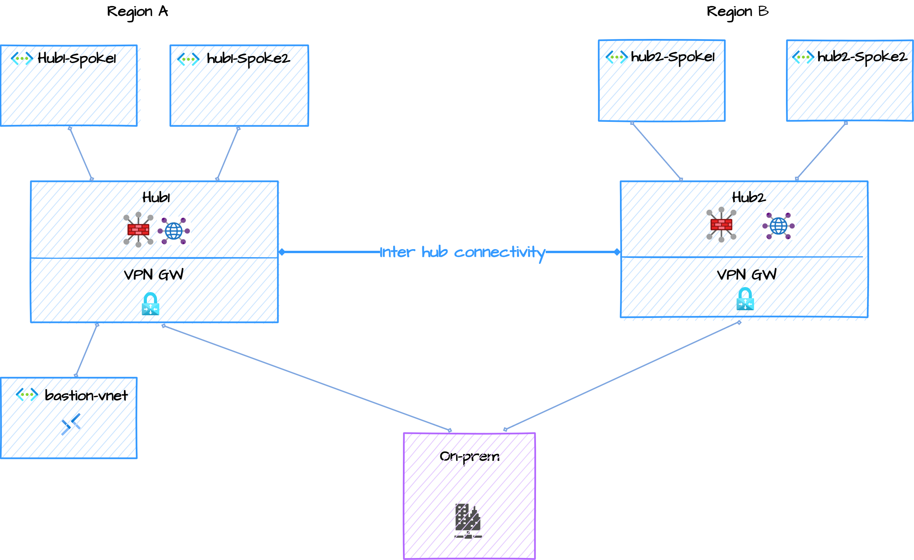

# Azure vWAN Secure Hub Lab (two-region)

> This lab script is based on work by Daniel Mauser (see *Credits & Source* below).

This repo contains a **Bicep-based deployment** for a two-hub **Virtual WAN** lab with spokes, branch VNets, VPN Gateways, Azure Firewall (Hub), Log Analytics, and Azure Bastion. Intended for **lab/demo** use to validate secured vHub and routing intent scenarios.

## Architecture



## Getting Started

### Clone the Repository

```powershell
git clone https://github.com/colinweiner111/azure-vwan-secure-hub-lab.git
cd azure-vwan-secure-hub-lab
```

## Deployment

Use the PowerShell deployment script:

```powershell
.\deploy-bicep.ps1 -ResourceGroupName <your-rg-name> -Location <region>
```

Example:
```powershell
.\deploy-bicep.ps1 -ResourceGroupName vwan-lab-rg -Location westus3
```

The script will:
1. Create the resource group
2. Deploy the Bicep template
3. Prompt for VM admin password if not provided

### Optional Parameters

- `-ResourceGroupName` (required): Name of the resource group
- `-Location` (optional): Azure region (default: script will prompt)

## Prerequisites

### Requirements

- **Azure Subscription** — An active Azure subscription with sufficient quota for the resources deployed
- **RBAC Role** — One of the following at the subscription or resource group level:
  - **Owner** — Full access (recommended for lab/demo)
  - **Contributor** — Can create all resources but cannot assign roles
- **Azure CLI or Azure PowerShell** — For deployment
- Logged in and default subscription set:
  ```powershell
  az login
  az account set --subscription "<SUBSCRIPTION_ID>"
  ```

> 💡 **Note:** This lab deploys Azure Firewall (Premium by default), VPN Gateways, and Bastion Standard — these have hourly costs. See [Cleanup](#cleanup) when done.

## What Gets Deployed

- vWAN + two vHubs
- Two spokes per hub
- Branch site with VPN Gateway (BGP)
- Azure Firewall (Hub) + Policy per hub
- Log Analytics Workspaces + diagnostic settings
- VM boot diagnostics
- Routing Intent (Private and Internet) with next hop = Azure Firewall
- **Azure Bastion — provides browser-based RDP/SSH access to all VMs (both hubs and branch)**
- **5 Ubuntu VMs:**
  - branch1-vm (in branch VNet)
  - hub1-spoke1-vm, hub1-spoke2-vm (in Hub 1 spokes)
  - hub2-spoke1-vm, hub2-spoke2-vm (in Hub 2 spokes)

## Default Configuration

- **Username**: `azureuser`
- **Password**: Prompted during deployment (set a strong password)
- **Regions**: Configured in Bicep parameters
- **VM Size**: Configured in Bicep parameters
- **Firewall SKU**: Configured in Bicep parameters

## VM Network Information

| VM Name | VNet | Subnet Range |
|---------|------|--------------|
| branch1-vm | branch1 | 10.100.0.0/24 |
| hub1-spoke1-vm | hub1-spoke1 | 172.16.1.0/27 |
| hub1-spoke2-vm | hub1-spoke2 | 172.16.2.0/27 |
| hub2-spoke1-vm | hub2-spoke1 | 172.16.3.0/27 |
| hub2-spoke2-vm | hub2-spoke2 | 172.16.4.0/27 |

*VMs receive dynamic IPs within their respective subnets*

## Accessing VMs via Azure Bastion

Azure Bastion provides secure, browser-based RDP/SSH access to Azure VMs without public IPs, aligning with Zero Trust principles and Azure Landing Zone standards.

In Azure Virtual WAN with Routing Intent, east-west traffic is forced through Azure Firewall, which breaks the standard Bastion "Connect to VM" flow that assumes direct VNet peering.

As a result, Bastion must use **"Connect via IP address"**, explicitly targeting the VM's private IP so traffic can traverse the vWAN routing fabric and firewall as intended.

> ⚠️ **Important:** Your Azure Firewall rules must allow RDP (3389) and/or SSH (22) from the Bastion subnet to the VM subnets.

> **References:**
> - [Connect to a VM via IP address (Microsoft Docs)](https://learn.microsoft.com/azure/bastion/connect-ip-address) — Official guide for using Bastion's IP-based connection feature (requires Standard SKU)
> - [Azure Bastion Routing in Virtual WAN (Jose Moreno)](https://blog.cloudtrooper.net/2022/09/17/azure-bastion-routing-in-virtual-wan/) — Deep dive into Bastion placement options and routing behavior in vWAN topologies

### Using Azure Portal (IP-based connection)
1. Navigate to **Azure Portal → Bastions**
2. Select **bastion-vnet-bastion**
3. Under **Connect**, select **Connection Settings**
4. Choose **Connect via IP address**
5. Enter the **private IP address** of the target VM (see [VM Network Information](#vm-network-information) or check the VM's network interface)
6. Enter username: `azureuser`
7. Enter the password you set during deployment
8. Click **Connect**

> 💡 **Tip:** Bastion Standard SKU is required for IP-based connections. This lab deploys Standard by default.

## Cleanup

When finished, delete the resource group:
```powershell
az group delete -n <your-rg> --yes --no-wait
```

## Credits & Source

This script is adapted from the excellent work in Daniel Mauser's repository:
https://github.com/dmauser/azure-virtualwan/tree/main/svh-ri-intra-region

Huge thanks to **Daniel Mauser** ([@dmauser](https://github.com/dmauser)) and **Jose Moreno** ([@erjosito](https://github.com/erjosito)) for sharing and maintaining these scenarios and guidance.

---

© MIT Licensed. See `LICENSE`.


